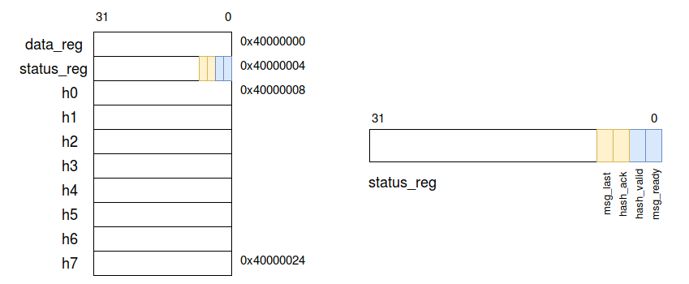
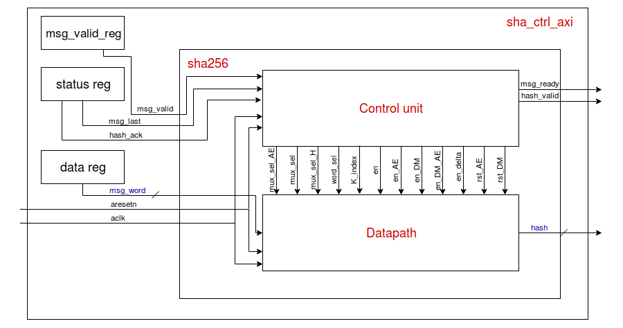
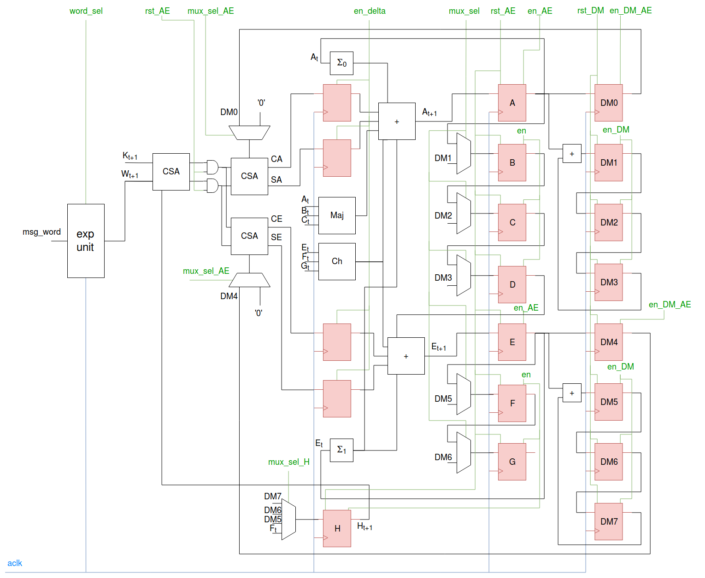
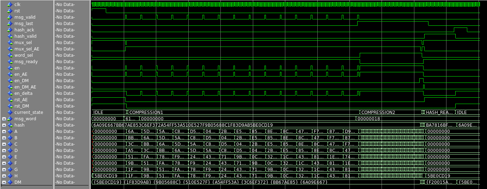

## Report SHA256 hardware accelerator - Digital Systems

- [Introduction](#introduction)
- [Specifications](#specifications)
  * [Hardware](#hardware)
  * [Software](#software)
- [Design](#design)
  * [Datapath](#datapath)
    + [Expansion unit](#expansion-unit)
    + [Operation rescheduling](#operation-rescheduling)
    + [Round Logic](#round-logic)
  * [Control Unit](#control-unit)
  * [AXI protocol](#axi-protocol)
- [Synthesis](#synthesis)
  * [Timing](#timing)
  * [Area](#area)
  * [Optimization](#optimization)
- [Driver](#driver)
- [Application](#application)
- [Testing](#testing)

## Introduction
The aim of the project is to design a **SHA256** hardware accelerator that will be synthesized for and mapped on the **Zynq** core of the **Zybo** board by Digilent. The hardware block will have a **AXI** compliant wrapper which allows it to take inputs and write outputs on specific registers using the AXI protocol.  
A driver must be designed and added to the GNU/Linux software stack uploaded on the board to properly interact with the SHA256 hardware. On top of that, a user application will be written to test the correct functioning of the system.  
More information of the SHA256 algorithm together with the pseudocode can be found on [Wikipedia](https://en.wikipedia.org/wiki/SHA-2).

## Specifications
### Hardware
The core of the SHA256 hardware block consists of a **datapath**, which manipulates the incoming words and produces the final hash driven by the control signals, and a **control unit**, a FSM which provides the control signals.  
The basic idea behind my implementation of the SHA256 datapath is inspired by some of the optimizations described in the [paper](http://soc.eurecom.fr/DS/sec/10.1.1.148.7900.pdf) by Chavez, Kuzmanov, Sousa, Vassiliadis.  
Specifically, I implemented operation rescheduling and hardware reutilization by dividing the computation of the final hash into different pipeline stages. Overall, the computation of the final hash should take more clock cycles with respect to the standard one, but the frequency should be higher and the occupied area smaller.  

After being properly initialized, the hardware block will process one 32-bit word at a time and will produce a 256-bit hash every 16 words (512 bits).  
From the AXI protocol point of view, it will act as a slave on the bus.  
Inputs and outputs are written on the following 32-bit registers:
* **data_reg** : at address **0x40000000**. It is written by the ARM processor and read by the SHA256 block. It contains the 32-bit word which will be processed by the hardware block.

* **status_reg** : at address **0x40000004**. It can be written and read by both (therefore is acts as a control register as well)
  * **status_reg(0)** = **msg_ready**. The hardware block signals that it is ready to process a new word by setting it to 1.
  * **status_reg(1)** = **hash_valid**. When set, it indicates that a whole 512-bit block has been processed and the result can be found in the h0 through h7 registers. It is written by the SHA256 block.
  * **status_reg(2)** = **hash_ack**. The processor sets this bit to signal that it has read the hash and the hardware block can get ready to receive a new word.
  * **status_reg(3)** = **msg_last**. It is set by the processor when the current word is the last one of the last 512-bit block.

* **h0**, **h1**, **h2**, **h3**, **h4**, **h5**, **h6**, **h7** : starting at address **0x40000008** till address **0x400000024** contain the words which constitute the hash of each 512-bit block. It is written by the SHA256 block and read by the processor.  



### Software
The SHA256 driver must support the following operations: **open**, **release**, **read**, **write**.  
Both read and write take care of one 32-bit word at a time.  

The user interface prompts the user to provide a message to hash. Since the message will be inserted through the keyboard it will always be a multiple of 8 bits.  
The first part of the SHA256 is the **padding**, which can be summarized in three operations:
* append a `'1'` bit at the end of the message
* append K `'0'` bits, where K is the minimum number >= 0 such that Len(message) + 1 + K + 64 is a multiple of 512
* append the length of the message in the last 64 bits

These operations are not computationally complex and, in addition, they are not regular (in the worst case a new 512-bit block must be added). Therefore, the padding will be implemented in software by the application itself.

## Design
The overall hardware design has been implemented as a hierarchical structure. The [datapath](vhdl/sha256_core.vhd), which instantiates the [expansion unit](vhdl/sha256_exp_unit.vhd), and the [control unit](vhdl/sha256_cu.vhd) are both contained by the [sha256](vhdl/sha256.vhd) wrapper. In turn, the wrapper is instantiated by the [sha256_ctrl_axi](vhdl/sha256_ctrl_axi.vhd) which defines the read and write FSM of the AXI protocol and defines the registers.  
Some useful functions has been defined in a [package](vhdl/sha256_pkg.vhd), together with the K constants and the H initialization values. For debug reasons, the package implements the whole SHA256 algorithms by itself, in order to compare the results during simulation, but it will not be synthesized.  
The block diagram is summarized in the following picture:


### Datapath
The datapath is the actual core of the SHA256 algorithm and has been build on the pipelined model proposed by the paper, as in the following picture:



#### Expansion unit
The expansion unit has been implemented in a straightforward way as a chain of 16 flip-flops. It takes as input the current 32-bit word and starts shifting and processing it at each clock cycle implementing the following relation:
```
s0 := (w[i-15] rightrotate 7) xor (w[i-15] rightrotate 18) xor (w[i-15] rightshift 3)
s1 := (w[i-2] rightrotate 17) xor (w[i-2] rightrotate 19) xor (w[i-2] rightshift 10)
w[i] := w[i-16] + s0 + w[i-7] + s1
```
A multiplexer selects the output: for the first 16 clock cycles it is the `w[i]` input itself, while for the next 48 cycles it is the output of the 16th flip-flop of the chain.
#### Operation rescheduling
The idea behind operation rescheduling is that some operations, specifically the ones needed to compute A and E, can be performed in advance. In particular:
```
δ[i] :=  H[i] + W[i] + K[i]
A[i+1] := Σ0(A[i]) + Σ1(E[i]) + Maj(A[i], B[i], C[i]) + Ch(E[i], F[i], G[i]) + δ[i]
```

Since `H[i] = G[i-1] = F[i-2]`, `K[i]` is a constant and `W[i]` can be precomputed, the computation of `δ` can be rescheduled to the previous clock cycle. In this way the sum would be less computationally complex, allowing to reduce the critical path of the resulting hardware.  
This implies the addition of a pipeline stage, therefore the sum `δ[i] := H[i] + W[i] + K[i]` can be carried out using a chain of [carry save adders](vhdl/csa.vhd). Instead of producing just one result as a standard adder, the carry save adder returns two vectors: the partial sum and the carry bits. In this way there is no carry propagation and the delay is greatly reduced.  

The first CSA, the leftmost one in the picture, receives as input `K[i+1]`, `W[i+1]` and `H[i+1]` which will be used to compute the value of A and E for the following round of the SHA256 algorithm. `H[i+1]` can be in turn selected among `DM7`, `DM6`, `DM5` and `F[i]`, according to the stage of the algorithm, by the selection signal `mux_sel_H`.  
The output of this first CSA goes into two other CSA. They usually sum all zeros, not modifying the result, but during the initialization phase. In fact, when a new hash has to be computed, A and E must be initialized to the constant value `0x6A09E667` and `0x510E527f` respectively. To do so, the output of the first CSA is kept to zero (`rst_AE` signal) together with all the other variables (B through G) while the multiplexers select `DM0` and `DM4` (`mux_select_AE` signal). These two values will pass unmodified through the CSAs and the pipeline registers and will be loaded into A and E.  
The output of the two CSAs is saved into the pipeline registers and in the following step will be summed to the required operands (Maj, Ch, ...) to compute the next values of A and E. This addition has been implemented with a simple `+` in vhdl and the optimization is left to the synthesis stage.

#### Round Logic
During the last stage of the 512-bit block processing the resulting hash must be loaded into the DM registers, summing the values currently in A to H to the ones already stored in the DMs:
```
DM0 := DM0 + A
DM1 := DM1 + B
DM2 := DM2 + C
DM3 := DM3 + D
DM4 := DM4 + E
DM5 := DM5 + F
DM6 := DM6 + G
DM7 := DM7 + H
```
However, it can be noticed that:
```
B[i] := A[i-1]
C[i] := A[i-2]
D[i] := A[i-3]
F[i] := E[i-1]
G[i] := E[i-2]
H[i] := E[i-3]
```
Therefore it is possible to avoid the instantiation of 8 adders, which will be area and power consuming, and employ instead only 2 of them, by implementing a shift-register-based round logic (on the right of the picture).  
The DM registers are reset (`rst_DM`) to the constant initial values defined in the package and are enabled (`en_DM`) during the last 3 cycles of the computation to sum the current values with the correct value of A and E and re-load them into the DMs.  
`DM0` and `DM4` are slightly different: they load directly the values of A and E, which comes with one clock cycles of delay with respect to the others; that is why they need a special enable `en_DM_AE`.
### Control Unit
The control unit is a Mealy FSM which consists of 7 stages:
* **IDLE** : the FSM remains in this state until `msg_valid` is set, signaling a new word to process. All DM registers are initialized to the constant values defined in the package. A through G are reset to 0, while H is set to the constant initial value in order to be ready for the pre-computation. The enable of the registers are at 0 so that the pipeline remains stalled.  
When `msg_valid` is set, the control unit raises the enables and registers A through G are loaded with the values in the DM.

* **INIT** : registers A through H are correctly initialized and signal `mux_sel` is set to start the compression algorithm.

* **COMPRESSION1** : it is the first phase of the compression algorithm, in which the pipeline waits for a new incoming word (`msg_valid`) and performs the computations. A counter indicates which value of constants `K` to choose.

* **COMPRESSION2** : when the counter reaches 15 the second phase of the compression algorithm stars. The pipeline does not need anymore new words because the `W` are provided by the expansion block. During the last cycles of compression the DM registers are enabled as described above, to start the round logic.

* **WAIT_HASH1** : A and E need one more clock cycle since they depend on the values of the other registers. At the end of this step, the pipeline is ready to start a new pre-computation to hash the following 512-bit block.

* **WAIT_HASH2** : `DM0` and `DM4` are loaded with the correct hash word. A new pre-computation of `δ` is started, if needed (`msg_valid` is set). Otherwise, if `msg_last` is set, signaling the last 512-bit block the next state becomes `HASH_READY`.

* **HASH_READY** : The pipeline outputs the final hash and raises `hash_valid` while waiting for `hash_ack`.


The following picture shows the behavior of the SHA256 main signals during the hash of a single 512-bit block. It can be seen that the pipeline remains stalled during `COMPRESSION1` phase because the words are not immediately available.



### AXI protocol

The AXI protocol read and write FSM are defined in the [sha256_ctrl_axi](vhdl/sha256_ctrl_axi.vhd) wrapper. It defines also the previously mentioned input and output registers.  
The SHA256 hardware block behaves as a slave on the bus and can write only on the last 2 bits of the status register and on the `h0` through `h7` registers.  
The processor, instead, can write the data register, status(3) and status(2), while all other mapped addresses will through a read-only error.  
A process takes care of producing the `msg_valid` signal : it is set every time the current state is `writing` (`s0_axi_awvalid` and `s0_axi_wvalid` are set at the same time) and the address corresponds to the one of the data register. In this way the hardware blocks knows when a new 32-bit word has been written and is available for computation.

## Synthesis
I run the synthesis with Vivado with the command
```bash
vivado -mode batch -source $ds2018/sha256/scripts/sha256_ctrl_axi.syn.tcl -notrace -tclargs $ds2018
```
and the [synthesis script](scripts/sha256_ctrl_axi.syn.tcl). The `freq` has been set to 100, which corresponds to a clock cycle of `10 ns`.  
The log file [runme.log](syn_reports/top_sha256_ctrl_axi_0_synth_1/runme.log) shows some warnings, but they are all related to the unconnected pins of the AXI protocol. Moreover, it provides some information about the components instantiated in the RTL:
```
Detailed RTL Component Info :
+---Adders :
	   4 Input     32 Bit       Adders := 1     
	   6 Input     32 Bit       Adders := 1     
	   2 Input     32 Bit       Adders := 2     
	   5 Input     32 Bit       Adders := 1     
	   2 Input      7 Bit       Adders := 1     
+---XORs :
	   3 Input     32 Bit         XORs := 5     
	   2 Input     32 Bit         XORs := 1     
	   3 Input      1 Bit         XORs := 96    
+---Registers :
	               32 Bit    Registers := 39    
	                7 Bit    Registers := 1     
	                3 Bit    Registers := 1     
	                2 Bit    Registers := 3     
	                1 Bit    Registers := 2     
+---Muxes :
	   2 Input     32 Bit        Muxes := 9     
	   4 Input     32 Bit        Muxes := 1     
	   2 Input      8 Bit        Muxes := 4     
	  15 Input      3 Bit        Muxes := 1     
	   6 Input      3 Bit        Muxes := 3     
	   2 Input      3 Bit        Muxes := 6     
	   3 Input      2 Bit        Muxes := 1     
	   7 Input      2 Bit        Muxes := 1     
	   2 Input      2 Bit        Muxes := 10    
	   4 Input      2 Bit        Muxes := 4     
	   3 Input      1 Bit        Muxes := 2     
	   7 Input      1 Bit        Muxes := 13    
	   2 Input      1 Bit        Muxes := 7     
	   4 Input      1 Bit        Muxes := 1     
	   6 Input      1 Bit        Muxes := 2     
	   5 Input      1 Bit        Muxes := 1    
```

and the number of logic cells for each sub-module:
```
Report Instance Areas:
+------+-----------------+----------------+------+
|      |Instance         |Module          |Cells |
+------+-----------------+----------------+------+
|1     |top              |                |  2378|
|2     |  U0             |sha256_ctrl_axi |  2378|
|3     |    sha256_hw    |sha256          |  2233|
|4     |      cu         |sha256_cu       |   455|
|5     |      dp         |sha256_core     |  1776|
|6     |        exp_unit |sha256_exp_unit |   521|
+------+-----------------+----------------+------+
```


### Timing
A detailed timing report can be found in [top_wrapper_timing_summary_routed](syn_reports/top_wrapper_timing_summary_routed.rpt) report. At the beginning the file gives some information about the clock, a `10 ns` clock with 50% duty cycle:
```

Clock       Waveform(ns)       Period(ns)      Frequency(MHz)
-----       ------------       ----------      --------------
clk_fpga_0  {0.000 5.000}      10.000          100.000         
```
In addition it specifies with a comment whether or not the defined constrained has been met:
```
All user specified timing constraints are met.
```
The report shows the critical path (source and destination pins) and the **slack** as well:

```
Slack (MET) :             1.141ns  (required time - arrival time)
  Source:                 top_i/sha256_ctrl_axi/U0/sha256_hw/cu/FSM_sequential_current_state_reg[2]/C
                            (rising edge-triggered cell FDRE clocked by clk_fpga_0  {rise@0.000ns fall@5.000ns period=10.000ns})
  Destination:            top_i/sha256_ctrl_axi/U0/sha256_hw/dp/F_reg[24]/D
                            (rising edge-triggered cell FDRE clocked by clk_fpga_0  {rise@0.000ns fall@5.000ns period=10.000ns})
```
The slack indicates that we still have some margin on the clock period, which can be further decreased by 1.141 ns.
### Area
From the [top_wrapper_utilization_placed](syn_reports/top_wrapper_utilization_placed.rpt) we can extract information about the utilization of the available resources, like the type and the number of registers, slice logic, memory and so on.  
We can see that the design, as expected, does not contain any latch.
```
+----------------------------+------+-------+-----------+-------+
|          Site Type         | Used | Fixed | Available | Util% |
+----------------------------+------+-------+-----------+-------+
| Slice LUTs                 | 1517 |     0 |     17600 |  8.62 |
|   LUT as Logic             | 1399 |     0 |     17600 |  7.95 |
|   LUT as Memory            |  118 |     0 |      6000 |  1.97 |
|     LUT as Distributed RAM |    0 |     0 |           |       |
|     LUT as Shift Register  |  118 |     0 |           |       |
| Slice Registers            | 1422 |     0 |     35200 |  4.04 |
|   Register as Flip Flop    | 1422 |     0 |     35200 |  4.04 |
|   Register as Latch        |    0 |     0 |     35200 |  0.00 |
| F7 Muxes                   |    0 |     0 |      8800 |  0.00 |
| F8 Muxes                   |    0 |     0 |      4400 |  0.00 |
+----------------------------+------+-------+-----------+-------+
```
Moreover, it provides some data about **primitives**, which are components native to the target architecture:
```
+----------+------+----------------------+
| Ref Name | Used |  Functional Category |
+----------+------+----------------------+
| FDRE     | 1224 |         Flop & Latch |
| LUT6     |  644 |                  LUT |
| LUT3     |  369 |                  LUT |
| LUT5     |  322 |                  LUT |
| LUT4     |  243 |                  LUT |
| FDSE     |  198 |         Flop & Latch |
| LUT2     |  165 |                  LUT |
| BIBUF    |  130 |                   IO |
| SRL16E   |   77 |   Distributed Memory |
| CARRY4   |   74 |           CarryLogic |
| SRLC32E  |   41 |   Distributed Memory |
| LUT1     |    9 |                  LUT |
| PS7      |    1 | Specialized Resource |
| BUFG     |    1 |                Clock |
+----------+------+----------------------+
```
In particular, we can see that 74 CARRY4 have been used. In fact, the FPGA provides a dedicated **fast lookahead carry logic** to perform fast arithmetic addition and subtraction. The user manual states that _"The CARRY4 primitive instantiates the fast carry logic available in each slice. This
primitive works in conjunction with LUTs to build adders and multipliers"_.  
This means that the instantiated additions have been optimized during synthesis, by mapping them of the fast lookahead carry logic made available by the target architecture, as expected.

### Optimization
Since the value of the slack indicates that the frequency can be increased I tried to resynthesize my design with a higher one. From the results, it appears that it can meet the timing constraints up to `125 MHz`:
```
All user specified timing constraints are met.

------------------------------------------------------------------------------------------------
| Clock Summary
| -------------
------------------------------------------------------------------------------------------------

Clock       Waveform(ns)         Period(ns)      Frequency(MHz)
-----       ------------         ----------      --------------
clk_fpga_0  {0.000 4.000}        8.000           125.000         

1. Slice Logic
--------------

+----------------------------+------+-------+-----------+-------+
|          Site Type         | Used | Fixed | Available | Util% |
+----------------------------+------+-------+-----------+-------+
| Slice LUTs                 | 1524 |     0 |     17600 |  8.66 |
|   LUT as Logic             | 1406 |     0 |     17600 |  7.99 |
|   LUT as Memory            |  118 |     0 |      6000 |  1.97 |
|     LUT as Distributed RAM |    0 |     0 |           |       |
|     LUT as Shift Register  |  118 |     0 |           |       |
| Slice Registers            | 1422 |     0 |     35200 |  4.04 |
|   Register as Flip Flop    | 1422 |     0 |     35200 |  4.04 |
|   Register as Latch        |    0 |     0 |     35200 |  0.00 |
| F7 Muxes                   |    0 |     0 |      8800 |  0.00 |
| F8 Muxes                   |    0 |     0 |      4400 |  0.00 |
+----------------------------+------+-------+-----------+-------+

Report Instance Areas:
+------+-----------------+----------------+------+
|      |Instance         |Module          |Cells |
+------+-----------------+----------------+------+
|1     |top              |                |  2378|
|2     |  U0             |sha256_ctrl_axi |  2378|
|3     |    sha256_hw    |sha256          |  2233|
|4     |      cu         |sha256_cu       |   455|
|5     |      dp         |sha256_core     |  1776|
|6     |        exp_unit |sha256_exp_unit |   521|
+------+-----------------+----------------+------+

```
For values larger than `125 Mhz` the synthesis fails with a critical warning:

```
CRITICAL WARNING: [Timing 38-282] The design failed to meet the timing requirements. Please see the timing summary report for details on the timing violations.
```

## Driver
The [device driver](C/sha256_driver.c) will equip the GNU/Linux software stack on the Zynq core of the Zybo board. As said, it should support four operations: open, release, read and write.  

* The **sha256_read** operation simply performs a call to **ioread32()** at the offset specified by the application (through **pread**) with respect to the base address. It can read 32 bits at a time and it is employed to read either the status register or the final hash (with a loop over the 8 registers). The data is then copied to the user specified buffer thorugh **copy_to_user**.

* The **sha256_write** operation can write 32 bits at a time calling **iowrite32()** at the offset specified by the application (through **pwrite**) with respect to the base address. The data is taken from the user specified buffer thanks to **copy_from_user**.

When the module is linked to or removed from the kernel the functions **sha256_probe** and **sha256_remove** are called respectively.  
The module has been compiled and installed in the root file system with the following commands:
```bash
> echo 'obj-m := sha_driver.o' > $tmp/C/Makefile
> cd $tmp/kernel
> make ARCH=arm M=$tmp/C modules
> make ARCH=arm M=$tmp/C INSTALL_MOD_PATH=$tmp/initramfs modules_install
```

## Application
The [application](C/sha256_app.c) serves as user interface. The user is prompted to insert the message he wishes to hash, the driver serves the necessary read and write requests and the result is finally returned to the user.  
Of course, the size of the message the user is going to insert is unknown (by definition of the SHA256 itself, it cannot be larger than 2^64 bits). Therefore, not to allocate a too large buffer, I fixed a maximum length `len_max` and `malloc`'ed `len_max` char for the user. The message is captured one byte at a time and, in case it exceeds the allocated length, a call to `realloc` allocates additional memory.
```c
cur_len = len_max;
sha_msg = (char*)malloc(len_max*sizeof(char));
...
while (( c = getchar() ) != '\n' && c != EOF){
    sha_msg[i++]=(char)c;
    if(i == cur_len){
          cur_len += len_max;
      sha_msg = realloc(sha_msg, cur_len);
      if(sha_msg == NULL) {
        exit(-1);
      }
    }
  }
```
Then, the application counts how many 512-bit blocks will be needed for the whole padded message and allocate the necessary memory, setting it to zero and appending a `'1'` at the end. In this case the `'1'` has 8 bits (char) reserved, since the input is character-based, but this would not work in a generic implementation of the SHA256.
```c
memset(blocks, 0, num_blocks * BLOCK_BYTES * sizeof(char));
memcpy(blocks, sha_msg_or, i);
blocks[i] = (char)0x80;
```
After that, the application guides the computation of the hash through the following steps:

1. For all the words contained in the necessary number of blocks (but 2, which represent the length and will be sent later), check that the SHA256 is ready to receive a new word  

    ```c
    for(i=0; i<(num_blocks*WORDS_IN_BLOCK-2); i++){
    if((pread(dev, &status, WORD_BYTES, STATUS_ADDR)) < 4) {
      puts("fail to read status register");
    }
    //check the device is ready and send one word
    while(0x01 != (status & 0x00000001));
```
2. Prepare the word and send it  

    ```c
    word_to_send = 0;
    for(j=0; j<4; j++){
      word_to_send |= ((uint32_t)blocks[j+i*4] << (32-8-j*8));
    }
    if((pwrite(dev, &word_to_send, WORD_BYTES, DATA_IN_ADDR))< 4){
      puts("fail to write word");
    }
```
3. At the end of the loop, send the first 32 bits of the length  

    ```c
    word_to_send = 0;
    word_to_send = ((uint32_t*)&num_bits)[1];

    if((pwrite(dev, &word_to_send, WORD_BYTES, DATA_IN_ADDR)) < 4){
    printf("fail to write block[%d]\n", i);
    }
```
4. Set bit 3 of the status register to signal the following one will be the last 32-bit word of the padded message and send it  

    ```c
    //signal the last word
    if((pwrite(dev, &msg_last, WORD_BYTES, STATUS_ADDR)) < 4){
    puts("fail to set bit 3 of status register");
    }
    //check the device is ready and send the last word
    if((pread(dev, &status, WORD_BYTES, STATUS_ADDR)) < 4) {
    puts("fail to read status register");
    }
    while(0x01 != (status & 0x00000001));
    word_to_send = 0;
    word_to_send = ((uint32_t*)&num_bits)[0];
    //printf("%x\n", word_to_send);

    if((pwrite(dev, &word_to_send, WORD_BYTES, DATA_IN_ADDR)) < 4){
    puts("fail to write word.");
    }
```
5. Wait the `hash_valid` bit to be set by the device and read sequentially the 8 registers in which the hash is stored  

    ```c
    //wait that the hash is valid
    while(0x3 != (status & 0x00000003));

    //read the hash words
    for(i=0; i<8; i++){
    if((pread(dev, &hash[i], WORD_BYTES, DATA_OUT_ADDR+i*4)) < 4) {
      puts("fail to read data out register");
    }
    }
```
6. Set bit 2 of the status register to acknowledge the hash, print it for the user and reset bit 2 and 3 of the status register to get ready for a new set of operations  

    ```c
    //signal the hash has been read
    if((pwrite(dev, &hash_ack, WORD_BYTES, STATUS_ADDR)) < 4) {
    puts("fail to write bit 4 of status register");
    }
    printf(">> Hash : ");
    for(i=0; i<8; i++){
    printf("%x ", hash[i]);
    }
    puts("");
    //go back to rst
    if((pwrite(dev, &rst_status, WORD_BYTES, STATUS_ADDR)) < 4){
    puts("fail to reset status register");
    }
```

Of course this is not the most efficient implementation since the peripheral device may be slow and the presence of `while` loops (busy wait) implies a polling on the device which may waste several clock cycles.  

## Testing

The application must be cross-compiled for the ARM processor:

```bash
arm-linux-gnueabihf-gcc -o sha_app.o sha_app.c
```
Then it must be copied into the root filesystem (I put it in `/bin`), which is eventully packed and prepared for `U-Boot`:
```bash
> cp sha_app.o $tmp/initramfs/binary
> cd $tmp/initramfs
> find | fakeroot -i $tmp/fakeroot.lst cpio -o -H newc | gzip -c > $tmp/new_rootfs.cpio.gz
> mkimage -A arm -T ramdisk -C gzip -d $tmp/new_rootfs.cpio.gz $tmp/sdcard/uramdisk.image.gz
```
In order to test the design the SD Card should contain: the binary version of the device tree, the boot image, the compressed Linux Kernel image with U-Boot header and the root file system with the necessary modules installed (and the executable of the application).  
Once mounted the SD Card on the board and connected the board to the PC it is possible to open a terminal and launch `picocom`:
```bash
picocom -b 115200 /dev/ttyUSB1
```
Then, it is necessary to load the module
```bash
insmod /lib/modules/4.6.0-xilinx-dirty/extra/sha256_driver.ko
```
and eventually the application can be tested
```bash
cd /bin
./sha256_app
```
Some examples follows, the second one in particular refers to the "critical" case of a 448-bits message which requires the addition of a new block.
```
 __          _   _   _                                                      
(_  |_|  /\   ) |_  |_    |_| \    /    _.  _  _  _  |  _  ._ _. _|_  _  ._
__) | | /--\ /_  _) |_)   | |  \/\/    (_| (_ (_ (/_ | (/_ | (_|  |_ (_) |  

>> Author : Martina Fogliato
>> Eurecom 2018
>> Digital Systems
>> Insert the text to be hashed, press enter to finish :

abc
>> Hash : ba7816bf 8f01cfea 414140de 5dae2223 b00361a3 96177a9c b410ff61 f20015ad
>> Insert the text to be hashed, press enter to finish :

abcdbcdecdefdefgefghfghighijhijkijkljklmklmnlmnomnopnopq
>> Hash : 248d6a61 d20638b8 e5c02693 c3e6039 a33ce459 64ff2167 f6ecedd4 19db06c1
>> Insert the text to be hashed, press enter to finish :

this thing is really working
>> Hash : b936d0e4 28567d18 37678607 42d13be6 daa6da33 a42f8732 9e69ef47 5e02ce61
>> Insert the text to be hashed, press enter to finish :


>> Bye bye!

```
